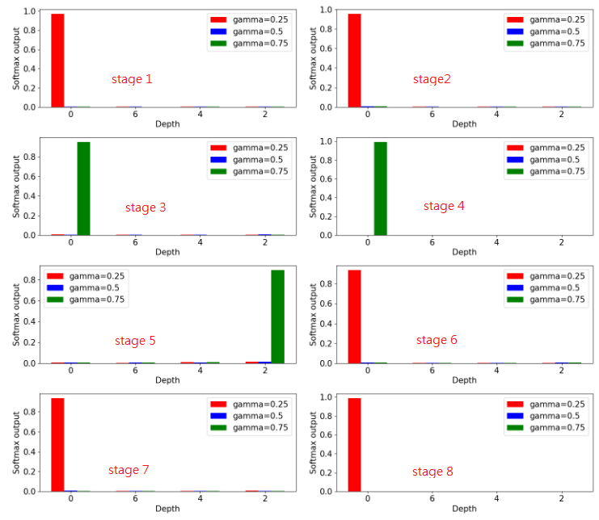
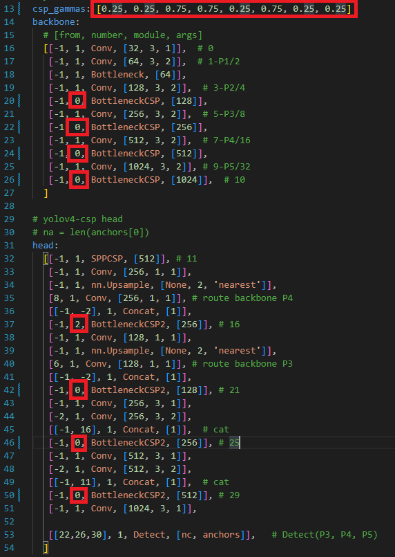

# Zero-DNAS

## File Structure
----
```
Zero-DNAS
├── CreamOfTheCrop_ScaledYOLO
│   └── data
│       ├── obj-st  (Link)
│       └── VOC2007 (Link) 
├── ScaledYOLOv4
│   └── data
│       ├── coco    (Link)
│       ├── obj-st  (Link)
│       └── VOC2007 (Link) 
│
├── CreamOfTheCrop_YOLOv5   (under testing)
│   └── data
│       ├── obj-st  (Link)
│       └── VOC2007 (Link) 
└── yolov5                  (not available)
    ├── data (Link)
    └── venv (x)
```
# Detail
- Search
    - search would conduct on 288 resolution, because we can't fit 416 resolution when using large search space
    - but flops calculation are conduct in 416 resolution
- Train
    - train would conduct on 416 resolution.
----
# Execution Step (For ScaledYOLOv4)
## 1 Search Command

```
cd CreamOfTheCrop_ScaledYOLO/

python tools/train.py --cfg experiments/configs/train/train.yaml --data voc.yaml --hyp hyp.scratch.yaml --device 1,2 --exp_name VOC-NAS-SS
```

- data: change the data.yaml file according the dataset you want to search for. (voc.yaml, coco.yaml ......)
- exp_name: name your experiment, later some of information during training would be store in the `CreamOfTheCrop_ScaledYOLO/experiments/workspace/train/{exp_name}`
    - alpha_distirbution.txt: the distribution of architecture parameter for each epoch.
    - beta_distribution.txt: the distribtuion of architecture parameter (normalized by softmax) for each epochs.
    - flops-{FLOPS}-wot-precalculated-it{ITERATIONS}.txt: the expectation of FLOPS during a period of training steps
    - history_thetas.txt: the beta distributionfor a period of training steps.
    - train.log: the training loss for a period of training steps.


## 2 Create Model Config
### 2-1 Plot Theta Distribtuion
```
python ./plot_thetas.py --exp_name VOC-NAS-SS --sp small
```
- exp_name: the experiment name, should same as the previous argument exp_name in tools/train.py 
- sp: describe the your search space
    - for small search space: depth is provided with [0,6,4,2] options
    - for large search sapce: depth is provided with [8,6,4,2] options
- After run the program, it would generate ```./experiments/workspace/train/{exp_name}/thetas.png```

### 2-2 (Optional) Plot Theta Distribution during training
- generate a GIF file for the change of beta-distribtion during training.
```
python ./plot_thetas_gif.py --exp_name VOC-NAS-SS --sp small
```


### 2-2 Create Model Config
- according the plot in ```CreamOfTheCrop_ScaledYOLO/experiments/workspace/train/{exp_name}/thetas.png```, \
modify the theta in ```ScaledYOLOv4/models/yolov4-csp-search.yaml```
\\


=> get gamma and depth pair in [[0, 0.25], [0, 0.25],[0, 0.75], [0, 0.75], [2, 0.25], [0, 0.75], [0, 0.25], [0, 0.25]]

- modify the theta in ```ScaledYOLOv4/models/yolov4-csp-search.yaml```, the result should be the image below



## 3 Train the model
python train.py --batch-size 16 --img 416 416 --data ./data/voc.yaml --cfg YOUR_MODIFIED_MODEL.yaml --weights '' --name VOC-NAS-L --hyp ./data/hyp.finetune.yaml

- cfg: model config. should be something like (yolov4-p5.yaml, yolov4-csp.yaml, yolov4-csp-search.yaml)

----
# Execution Step (For YOLOv5)
tobe continue

<!-- ## Training Command
python ./train.py --data ./data/voc.yaml --hyp ./data/hyp.finetune.yaml --cfg ./models/yolov5m.yaml --batch-size 16 --weights '' --device 1 --img-size 416 -->


<!-- 
    .
    └── VOCdevkit
        └── VOC2007
            ├── SegmentationObject
            ├── SegmentationClass     
            ├── JPEGImages      
            │   ├── 009961.jpg      
            │   ├── 009959.jpg      
            │   └── ...
            ├── ImageSets      
            │   ├── Segmentation      
            │   ├── Main       
            │   │   ├── ...
            │   │   ├── trainval.txt
            │   │   └── ...     
            │   └── Layout      
            ├── Annotations  
            │   ├── 009961.yaml      
            │   ├── 009959.yaml     
            │   └── ...        
            └──


    VOC2007
    ├── images      
    │   ├── 009961.jpg      
    │   ├── 009959.jpg      
    │   └── ...
    ├── annotations  
    │   ├── 009961.yaml      
    │   ├── 009959.yaml     
    │   └── ...        
    ├── labels          # Empty Folder Now !!!
    ├── trainval.txt    # Should Change A Little Bit Later !!
    └── xml2yolo.py     # Would Provide Latter !!
            


    VOC2007
    ├── images      
    │   ├── 009961.jpg      
    │   ├── 009959.jpg      
    │   └── ...
    ├── annotations  
    │   ├── 009961.yaml      
    │   ├── 009959.yaml     
    │   └── ...        
    ├── labels         
    │   ├── 009961.txt      
    │   ├── 009959.txt     
    │   └── ...        
    ├── classes.txt     # Would Be Generated After Running xml2yolo.py   
    ├── trainval.txt   
    ├── test.txt        # Generate test.txt is the same way as trainval.txt
    └── xml2yolo.py     


    ScaledYOLOv4
    ├── data      
    │   └── VOC2007    
    │       └── ...
    │   ├── voc.yaml
    │   ├── coco.yaml
    │   ├── hyp.finetune.yaml
    │   ├── hyp.scratch.yaml
    │   └── ...
    ├── models 
    │   └── ...
    ├── utils        
    │   └── ...
    ├── LICENSE
    ├── README.md   
    ├── detect.py
    ├── test.py
    └── train.py      -->
